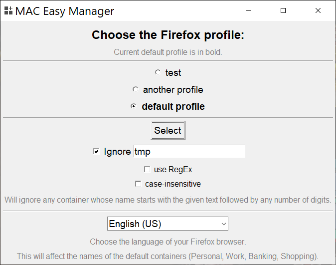
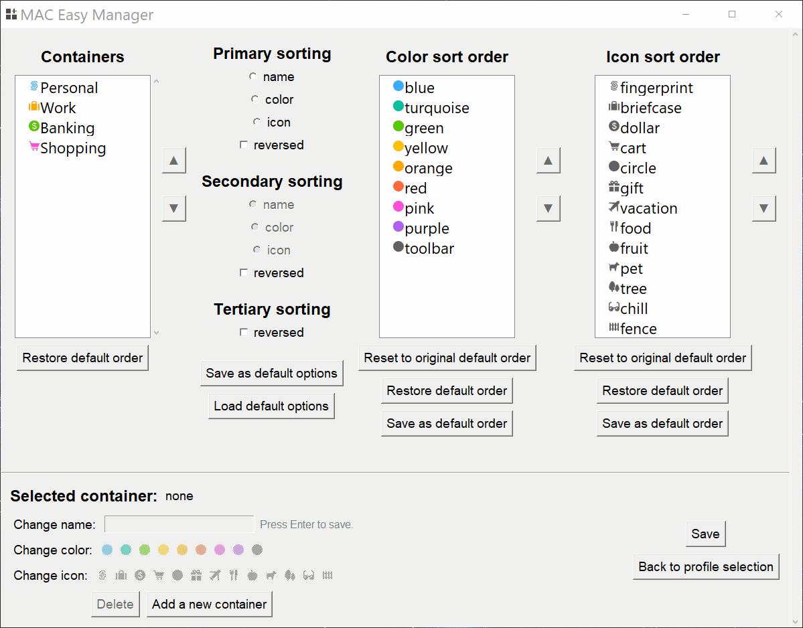

# MAC Easy Manager

A manager for Firefox's [Multi-Account Containers](https://addons.mozilla.org/en-US/firefox/addon/multi-account-containers/) on Windows.

## What it does

MAC Easy Manager allows you to:

- sort containers by name, icon, color (also in reverse)
- modify color and icon sorting order to your own and save it
- reorder containers manually
- modify name, icon, color of individual or multiple containers
- delete containers
- add containers

It also works with the [Temporary Containers](https://addons.mozilla.org/en-US/firefox/addon/temporary-containers/) extension and allows you to ignore containers that start with a certain text (for example _tmp_), or you can use a custom regular expression.

## How to use

1. In the first window:

   - Choose the Firefox profile whose containers you want to edit. All profiles with a _containers.json_ file are listed, the default profile being in bold.
   - Decide if you want to ignore any containers. All containers whose name start with the given text, optionally followed by digits, will be ignored.
     - Alternatively, you can provide a custom regular expression. All containers whose name matches the pattern will be ignored.
     - You can choose to ignore case for both plain text and regular expression.
   - Choose the language version of your Firefox browser. This will affect the names of the default containers (Personal, Work, Banking, Shopping).
     - Language may be detected automatically from the _prefs.js_ or _user.js_ file.
     - Translations are taken from the available [language packs for Firefox](https://addons.mozilla.org/en-US/firefox/language-tools/) (as of February 2021).
   - Click "Select".

2. In the second window:
   - Click on an individual container, or on multiple containers while holding Ctrl, to change their name, color, icon, move them up or down, or delete them.
     - You can select all containers with Ctrl + A.
     - You can delete containers with Delete key.
     - You can restore the order of the containers to what it was before you made any changes.
   - Choose sorting options to sort by name, color, icon, also in reverse.
     - You can save current options as your default options, which will be stored in _sorting_options.json_ file.
     - You can load your default options.
   - Move colors or icons up or down to change sorting order.
     - You can save current order as your default order, which will be stored in _default_order.json_ file and will be loaded with every launch of the program.
     - You can restore to your default order after you moved colors/icons up or down.
     - You can also restore to original Firefox order.
   - Click "Save" to save changes made to containers. A backup of the original state of containers is saved to _backups_ folder in the program's location.

## Future

The project is basically closed and I do not plan to maintain it. I wrote the basic version of it after 3-4 months of learning Python and I know the code is not the best, and terribly organized, but maybe someone will find it useful. I may fix small bugs if there are any. You can fork it freely.
